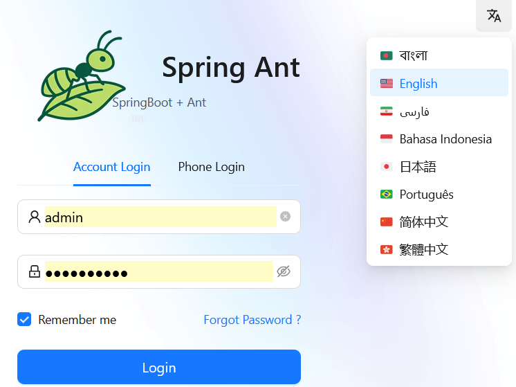
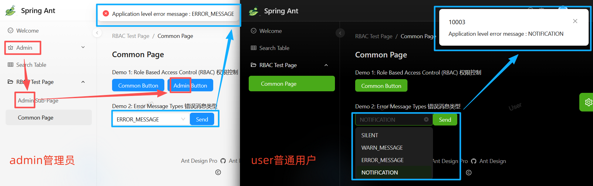
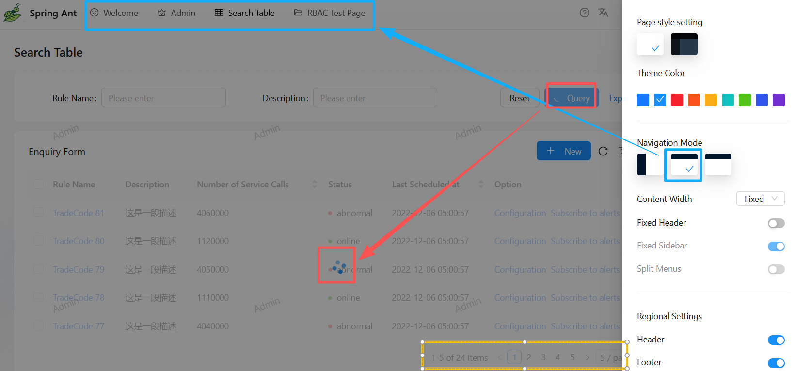

Language : [English](README.md)

# Sprint Ant Family
Sprint Ant Family 由三个开源仓库组成，旨在实现 Web 应用的快速开发。  
- **Sprint Ant Backend**：本仓库。
- **[Sprint Ant Frontend](https://github.com/HKPC-1967/spring-ant-frontend)**：基于 **Ant Design Pro** 的 React 框架。
- **[Sprint Ant Frontend API Core](https://github.com/HKPC-1967/spring-ant-frontend-api-core)**

你可以根据需求选择以下组合：
- Backend + Frontend（用于快速构建一个**后台管理系统**）  
  我们已提供演示服务器供体验：http://20.114.26.109/（用户名：`admin` 或 `user`，密码：`ant.design`）

- Backend + Frontend API Core + 你现有的前端（当你不使用 **Ant Design Pro** 作为 UI 框架时）

## 功能亮点
- 基于 JWT Token 的登录认证  
- 多语言支持  

- 基于角色的访问控制（后端 API 使用 Spring Security RBAC）  
  如下图红框所示：左侧管理员admin可访问 "admin page"、"admin sub-page"、"admin button"，右侧普通用户user则无权限。
- 错误码与展示类型  
  如下图蓝框所示：后端可按业务需要返回不同错误码与展示类型；同时对网络层与 HTTP 层错误有进行统一处理。  
- 可配置布局：深色模式、主题色、导航模式（侧边、顶部、混合）等。 

- 加载动画（如下图红框）
- 请求处理中使用遮罩层，防止用户误操作
- 分页（如下图黄框）

---

# Sprint Ant Backend
一个用于快速开发的 Java Spring Boot 后端框架，核心特性包括：JWT 认证、RBAC（Spring Security）、AOP 切面（统一 API 格式、日志与错误处理）、分页，以及基于 PostgreSQL -> MyBatis Generator -> Swagger（SpringDoc）的流水线式模型代码生成。

## [数据库初始化](./readme/database_initialization.md)

## 构建项目
* Gradle（用于构建 .jar 文件；你可以根据操作系统将 "/" 改为 "\\"）   
`./gradlew clean`  
`./gradlew build -x test`
* Docker（用于构建 Docker 镜像）   
`docker build -t spring_ant_backend:0.0.1 .`

## DEV 环境（application-dev.yml）下的 5 种运行方式

* 使用 IDEA Ultimate Edition 运行（推荐用于本地开发与调试） 
Edit Configuration -> Active profile: `dev`

* 使用 IDEA Community Edition 运行（推荐用于本地开发与调试） 
Edit Configuration -> Environment variables: `SPRING_PROFILES_ACTIVE=dev`

* 使用 Gradle 运行  
`./gradlew bootRun -Dspring.profiles.active=dev`

* 在 Linux 上以后台进程运行 "java spring_ant_backend-0.0.1-SNAPSHOT.jar"  
`nohup java -jar  .\spring_ant_backend-0.0.1-SNAPSHOT.jar   --spring.profiles.active=dev &`

* 使用 Docker 运行（推荐用于生产环境） 
`docker run -d --add-host host.docker.internal:host-gateway -p 8080:8080 -e SPRING_PROFILES_ACTIVE=dev --name spring_ant_backend spring_ant_backend:0.0.1`   

## OpenAPI（Swagger）地址
用户名和密码在 [application-dev.yml](src/main/resources/application-dev.yml) 的 `swagger-auth` 下配置。
- Web UI：  
http://localhost:8080/api/swagger-ui/index.html
- OpenAPI JSON：  
http://localhost:8080/api/api-docs

## [框架设计](./readme/framework_design.md)

## [后续发布计划、代码贡献与代码规范](./readme/code_contribution.md)
