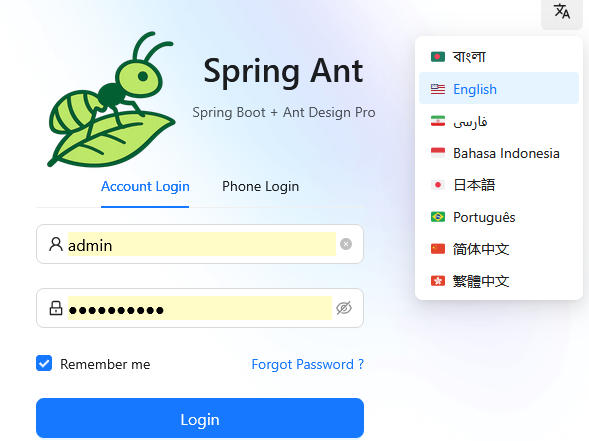
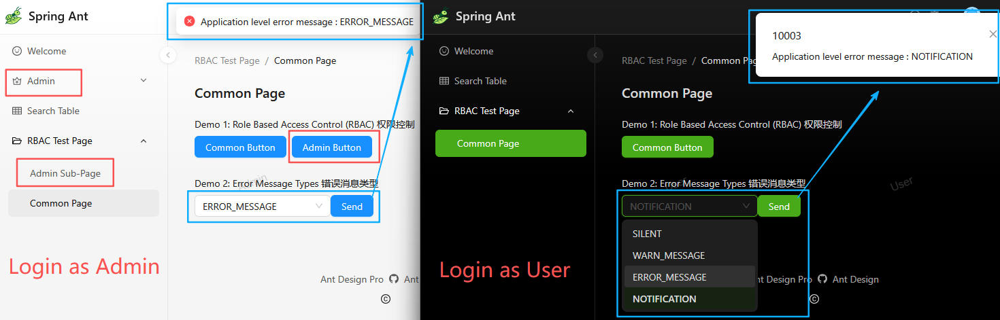
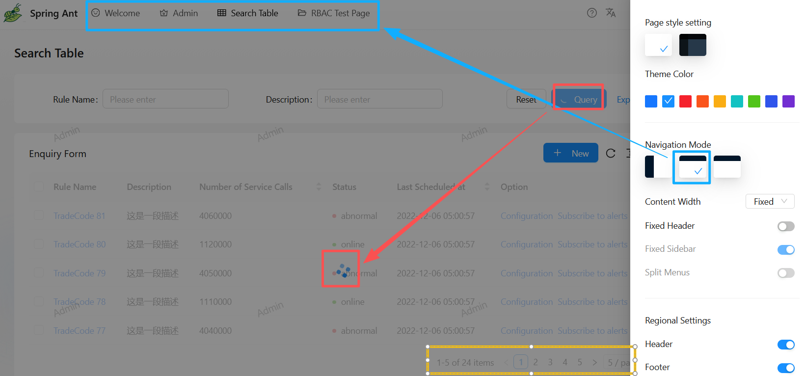

Language : [English](README.md) | [简体中文](README.zh-CN.md)

# Sprint Ant Family
Sprint Ant Family 由三個開源倉庫組成，旨在實現 Web 應用的快速開發。  
- **Sprint Ant Backend**：Spring Boot 後端（本倉庫）。
- **[Sprint Ant Frontend](https://github.com/HKPC-1967/spring-ant-frontend)**：基於 **Ant Design Pro** 的 React 框架，用於快速構建一個**後台管理系統**。
- **[Sprint Ant Frontend API Core](https://github.com/HKPC-1967/spring-ant-frontend-api-core)**：當你不使用 **Ant Design Pro** 作為 UI 框架時，可以將核心 TypeScript 程式碼（大約 200 行）複製到你現有的前端項目中，以快速整合 **Sprint Ant Backend** API。

## 功能亮點
- 基於 JWT Token 的登入認證（預設使用者名稱：`admin` 或 `user`，密碼：`ant.design`）  
- 多語言支援  

- 基於角色的存取控制 (RBAC)  
  如下圖紅框所示：左側管理員 admin 可存取 "admin page"、"admin sub-page"、"admin button"，右側普通使用者 user 則無權限。後端用Spring Security實現RABC。
- 錯誤碼與展示類型  
  如下圖藍框所示：後端可按業務需要返回不同`錯誤碼`與`展示類型`；同時前端對網絡層與 HTTP 層錯誤進行統一處理。  
- 可配置佈局：深色模式、主題色、導航模式（側邊、頂部、混合）等。
 

- Loading 狀態管理（`局部loading動畫`和`全局遮罩層`，避免請求進行中用戶繼續操作）（如下圖紅框）
- 分頁（如下圖黃框）
 

---

# Sprint Ant Backend
一個用於快速開發的 Java Spring Boot 後端框架，核心特性包括：JWT 認證、RBAC（Spring Security）、AOP 切面（統一 API 格式、日誌與錯誤處理）、分頁，以及基於 PostgreSQL -> MyBatis Generator -> Swagger（SpringDoc）的流水線式模型程式碼生成。

## [資料庫初始化](./readme/database_initialization.zh-HK.md)

## 建構項目
* Gradle（用於建構 .jar 檔案；你可以根據操作系統將 "/" 改為 "\\"）   
`./gradlew clean`  
`./gradlew build -x test`
* Docker（用於建構 Docker 鏡像）   
`docker build -t spring_ant_backend:0.0.1 .`

## DEV 環境（[application-dev.yml](src/main/resources/application-dev.yml)）下的 5 種運行方式

* 使用 IDEA Ultimate Edition 運行（推薦用於本地開發與除錯） 
Edit Configuration -> Active profile: `dev`

* 使用 IDEA Community Edition 運行（推薦用於本地開發與除錯） 
Edit Configuration -> Environment variables: `SPRING_PROFILES_ACTIVE=dev`

* 使用 Gradle 運行  
`./gradlew bootRun -Dspring.profiles.active=dev`

* 在 Linux 上以背景進程運行 "java spring_ant_backend-0.0.1-SNAPSHOT.jar"  
`nohup java -jar  .\spring_ant_backend-0.0.1-SNAPSHOT.jar   --spring.profiles.active=dev &`

* 使用 Docker 運行（推薦用於生產環境） 
`docker run -d --add-host host.docker.internal:host-gateway -p 8080:8080 -e SPRING_PROFILES_ACTIVE=dev --name spring_ant_backend spring_ant_backend:0.0.1`   

## OpenAPI（Swagger）地址
使用者名稱和密碼在 [application-dev.yml](src/main/resources/application-dev.yml) 的 `swagger-auth` 下配置。
- Web UI：  
http://localhost:8080/api/swagger-ui/index.html
- OpenAPI JSON：  
http://localhost:8080/api/api-docs

## [框架設計](./readme/framework_design.zh-HK.md)

## AI Coding 最佳實踐

#### 1. 基於核心架構，確保底座安全
由零開始叫 AI 砌個 Framework 出嚟，好難保證到架構質素同安全性。因此，**強烈建議叫 AI 喺已經驗證過嘅核心基礎框架上面做開發**。
- **優勢**：框架底座可靠、安全可控，AI 只需要專注實現業務邏輯，可以大幅提升開發效率同代碼質素。

#### 2. 前後端配置 `AGENTS.md`，統一上下文認知
`AGENTS.md` 係 AI 專屬嘅上下文指南。佢可以令 AI 清楚了解前後端嘅核心架構、技術棧同埋接口對接規範，避免 AI 出現「幻覺」或者偏離原本嘅架構設計。

#### 3. 單個 Prompt 驅動完整業務生成
經過實測，淨係用 **一個 Prompt** 就可以令 AI 生成完整兼且跑得郁嘅前後端業務。
- **示例場景**：「*有個 XX 業務，包含 Admin 同 User 兩個角色，分別有 XX 功能。*」（實際嘅 Prompt 複雜好多。）
- **執行效果**：AI 能夠精準理解已經設計好嘅 RBAC 權限架構，自動搞掂業務表結構設計同埋前後端代碼生成，實現端到端嘅業務落地。

## [後續發佈計劃、程式碼貢獻與程式碼規範](./readme/code_contribution.zh-HK.md)

## 為什麼我們建立這個開源項目
這個項目由香港生產力促進局（HKPC）的 Nick、Jacob 和 Ken 開源。最初的想法來自我們發現 Ant Design Pro 是一個非常出色的 React UI 解決方案，但並沒有一個現成直接可用的後端框架與之配套。我們希望將這個項目開源幫到有需要的其他人。例如，中小企業（SMEs）可以利用這個項目，快速搭建一個後台管理系統。即使你不懂 Java 和 Spring Boot 也不用擔心 —— 你只需要先把它Run起來，詳細的文件與程式碼註解會幫助你快速上手。

如果這個項目在任何方面對你有幫助，歡迎告訴我們；如果你有任何問題，也歡迎在 **[GitHub Discussions 頁面](https://github.com/HKPC-1967/spring-ant/discussions)** 中提問。你的支持與回饋對我們非常寶貴。

