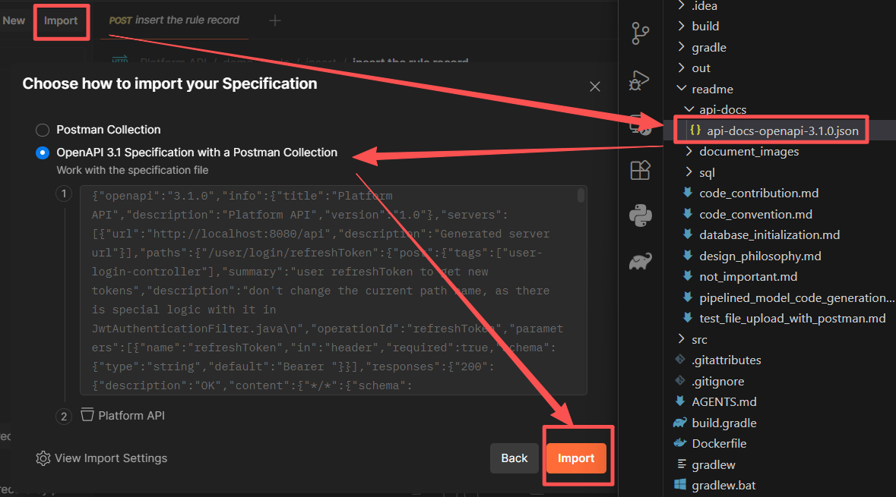
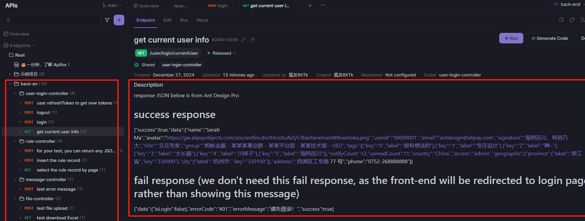

## 流水线（Pipeline）式模型代码生成  
这是一种从 PostgreSQL 数据库表结构到 MyBatis Generator 代码，再到 Controller 的 HTTP POST DTO，最后到 SpringDoc 注解的流水线式模型代码生成方法。  
它可以帮助开发者更快开发、统一维护并减少重复工作。  

### 设计理念  
- 相比 Hibernate（全 ORM 框架），我们选择 MyBatis（半 ORM 框架），因为它在灵活性、可控性和原生 SQL 友好性方面更好，新人也更快上手。  
- Pipeline 思想在软件工程中很常见：一个任务的输出成为下一个任务的输入，从而形成流水线。  
- 该方法并非全自动，而是有意设计成半自动：机器处理大部分重复工作，人工保留灵活决策空间。  
- 一个关键理念是以数据库表注释作为单一事实来源，在一个地方维护元数据，再传播到 Model、Mapper、DTO 和 API 文档。  

### 代码实现细节  
[MybatisGenerator.java](./../src/main/java/org/hkpc/dtd/component/postgres/mybatis/generator/MybatisGenerator.java)  
[generator-configuration.xml](../src/main/resources/generator-configuration.xml)  
[CustomCommentGenerator.java](./../src/main/java/org/hkpc/dtd/component/postgres/mybatis/generator/CustomCommentGenerator.java)  
[OpenApiConfig.java](./../src/main/java/org/hkpc/dtd/common/config/OpenApiConfig.java)  

### Pipeline 的 3 个核心阶段  
1. PostgreSQL 数据库表结构设计  
   所有表注释、字段注释和数据类型都在 PostgreSQL 表结构中定义，字段注释以数据库为准并统一维护。  

2. 由 MyBatis Generator 生成 Java 代码  
   MyBatisGenerator.java 可根据数据库表结构自动生成 Model（实体类）、Mapper（接口）和 Mapper XML（SQL 映射文件）。  
   通过 CustomCommentGenerator.java 的配置，生成的 Model 和 Mapper 会带有表与字段注释，并符合 SpringDoc 的 @Schema 规范。  

3. 复制 MyBatis Model 为 DTO  
   可以将 MyBatis 的 model 复制为 DTO（HTTP POST 入参）；由于字段已包含 @Schema 元数据，生成的 OpenAPI（Swagger）文档会直接带出字段注释。  

### Pipeline 的 3 个可选阶段  
1. 将测试过的 JSON 放入 Swagger 描述  
   你可以将测试过的响应 JSON 粘贴到 Controller 的 "Swagger(@Operation) description" 中，随后会显示在 Swagger UI。  

2. 将 JSON 转换为 TypeScript 对象  
   你也可以使用 JSON 转 TypeScript 工具将响应 JSON 转换为前端 TypeScript 对象。  
   - https://transform.tools/json-to-typescript  
   - https://quicktype.io/typescript  
   - AI Copilot 工具 (如 GitHub Copilot)  

3. 将 OpenAPI JSON 导入 API 工具  
   你可以将导出的 OpenAPI JSON 配置文件导入 Postman 或 Apifox 等工具。  
   - 导入到 Postman  
       
   - 导入到 Apifox  
       
